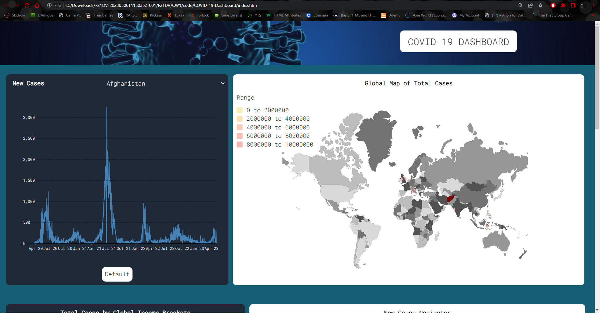
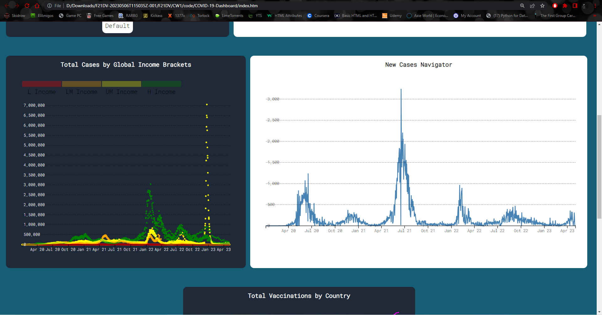
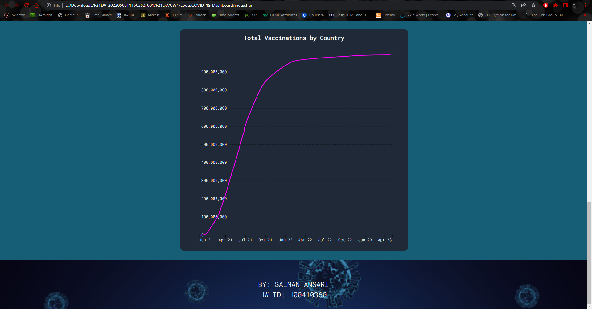

# COVID-19-Dashboard

## About the Project

This project is a COVID-19 Dashboard created using HTML and D3.js v7. The dashboard makes use of the COVID-19 dataset: https://github.com/owid/covid-19-data/blob/master/public/data/owid-covid-data.csv and COVID-19 Vaccinations dataset: https://github.com/owid/covid-19-data/blob/master/public/data/vaccinations/vaccinations.csv

## Screenshots

    <b>Dashboard</b>

## Installation

Open the index.html file in a web browser (preferably Chrome).

## Technologies Used

1. HTML
2. D3.js v7
